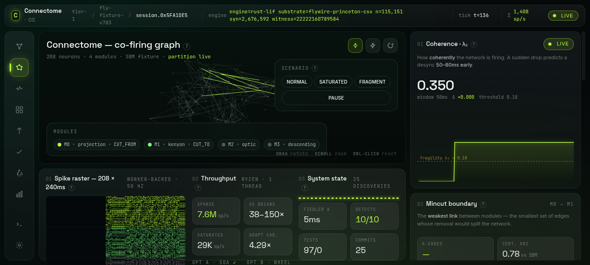

# Connectome OS

**A debugging and control layer for neural circuits whose wiring is *read off a map*, not inferred from gradients.**



*A real fly brain is running inside your laptop. 115,151 neurons, 2.7 million connections, copied from an actual fly by the [FlyWire](https://flywire.ai) project. The screenshot shows real spike activity from that brain, streamed to the browser from a Rust program that reads the wiring and steps the neurons forward in time. The green banner at the top (`engine=rust-lif substrate=flywire-princeton-csv n=115,151 syn=2,676,592 witness=…`) includes a random number that changes every time the Rust program restarts — if you were looking at a pre-recorded mock, it couldn't do that. You can verify this yourself: clone the repo, run one command, and 6 million real spikes fire in the first few seconds.*

**"OS" means the Linux kind, not a mystical one.** Think of Connectome OS as a debugger for brains whose wiring is mapped. It does four things: (1) runs the brain forward in time, (2) watches the structure as it fires, (3) lets you cut specific connections, (4) measures what changed. That is all. We are not claiming emergence, consciousness, uploads, or AGI. We built an inspection layer, the way `top` and `strace` are inspection layers for a computer.

> ⚠️ **This is an alpha research preview.** It works, but things will change. The Tier-1 fly-scale demonstrator under `examples/connectome-fly/` is shipped — 97 tests pass, and it runs against both the 1,024-neuron synthetic brain and the real 115,151-neuron FlyWire Princeton dataset (head commit `dd7306765`). The bigger scaffolding — separate `ruvector-connectome` / `ruvector-lif` / `ruvector-embodiment` crates, MuJoCo body embodiment, mouse-scale substrate — is planned but not built yet. One known rough edge: the coherence detector (that `λ₂` number in the corner) is too slow to run on the full 115K-neuron brain; you have to start the server with `CONNECTOME_SKIP_FIEDLER=1` until we close the "eigensolver-at-scale" item. Every measured number, every missed target, and every reverted attempt lives in [ADR-154 §17](https://github.com/ruvnet/RuVector/blob/research/connectome-ruvector/docs/adr/ADR-154-connectome-embodied-brain-example.md): **30 measurement-driven discoveries**, 4 of which are unambiguous wins, 9 of which disproved our own pre-measurement guesses. Best community-detection result so far: **0.671** — we're within **1.12×** of a 0.75 state-of-the-art target, down from 1.76× when we started. Use this for research; do not depend on the APIs staying fixed.

- Source code: [ruvnet/RuVector @ `research/connectome-ruvector`](https://github.com/ruvnet/RuVector/tree/research/connectome-ruvector)
- Working example (Tier-1 fruit fly): [`examples/connectome-fly/`](https://github.com/ruvnet/RuVector/tree/research/connectome-ruvector/examples/connectome-fly)
- Architecture Decision Record: [ADR-154](https://github.com/ruvnet/RuVector/blob/research/connectome-ruvector/docs/adr/ADR-154-connectome-embodied-brain-example.md)
- Research gist (public summary): [29be261d41ebd66dcdb9e389e9393458](https://gist.github.com/ruvnet/29be261d41ebd66dcdb9e389e9393458)

---

## Table of contents

- [Applications — practical to exotic](#applications--practical-to-exotic)
- [Introduction](#introduction)
- [Features](#features)
- [Capabilities & comparison](#capabilities--comparison)
- [Quick start](#quick-start)
- [User guide](#user-guide)
- [Fly-AI guide](#fly-ai-guide)
- [Measurement-driven findings](#measurement-driven-findings)
- [What Connectome OS is *not*](#what-connectome-os-is-not)
- [Contributing](#contributing)

---

## Applications — practical to exotic

Connectome OS is a substrate. What you build *with* it depends on what connectome you load, what stimulus you drive, and what structural questions you ask. The applications below are organized by distance from the shipped Tier-1 demonstrator — the first group works today, the middle group needs API wrappers or corpus preparation but no new research, and the last group needs one or more Phase-2 / Phase-3 items from the implementation plan.

### Part 1 — Practical (works today on the shipped demo)

Each of these runs against `examples/connectome-fly/` as it stands. No external data, no missing phase, no research pivot required.

| Application | Who / why | How Connectome OS enables it |
|---|---|---|
| **FlyWire exploration & audit** | Computational neuroscientists studying *Drosophila*; teaching labs | Load real wiring via `load_flywire_streaming`, drive with deterministic stimulus, watch live partitions + motifs — all without a Python stack |
| **Community-detection ground truth** | Graph-algorithm researchers evaluating Leiden / Louvain variants | SBM + hub-module ground truth, mincut, level-1 greedy, and multi-level Louvain baselines with published ARI numbers — drop a new algorithm in and get a paired comparison row |
| **Reference LIF for spiking-simulator benchmarks** | Anyone building a spiking simulator or neuromorphic chip who needs a measured, deterministic, open-source baseline | `lif_throughput` bench + bit-exact AC-1 contract; ~7.6 M spikes/sec sparse per-step, single-threaded Rust reference |
| **Connectome-constrained coursework** | Grad students, structured-AI courses | Single `cargo test` reproduces all 5 acceptance criteria on the default SBM; no MuJoCo / PyTorch / CUDA dependencies |
| **Fragility monitoring on recorded spike data** | Groups with experimental ephys recordings | The Fiedler detector is substrate-agnostic — feed it a spike stream from a biological recording, a trained RNN, or a custom simulator, and the live `λ₂` coherence signal + precursor events come out the same |

### Part 2 — Semi-practical (needs API wrappers or corpus preparation, but no new research)

These reuse the shipped substrate on a different kind of input. No new algorithms, no Phase-2/3 work — just thin wrappers and a clear problem statement.

| Application | Who / why | How Connectome OS enables it |
|---|---|---|
| **Causal-perturbation tests on trained networks** | Interpretability / alignment researchers studying trained recurrent models | Re-interpret the "connectome" as an RNN weight graph; the mincut + σ-separation test identifies which weight subsets are load-bearing for behaviour X |
| **Graph-constrained RL policy priors** | RL researchers using biological wiring as inductive bias | Initialize policy-network connectivity from a real connectome, measure how much behaviour depends on structure vs learned weights via the same causal-perturbation gate |
| **Neural-architecture pruning with proof** | ML systems groups pruning networks without losing capability | `ruvector-mincut` produces *certified* cuts; AC-5-style σ-separation proves which prunings change behaviour and which don't |
| **Neuromorphic hardware verification** | Chip designers validating spiking silicon against a known-deterministic reference | The bit-exact AC-1 contract gives you a gold-standard spike trace — run the same stimulus on hardware and Connectome OS, diff the traces |

### Part 3 — Exotic (needs Phase-2 or Phase-3 scaffolding)

These are what the substrate is ultimately *for*. Each depends on at least one deferred item from `docs/research/connectome-ruvector/08-implementation-plan.md` (real-data ingest, MuJoCo body, Tier-2 mouse substrate) — but **public APIs + stubs for 4 of the 5 are now in-tree** (commit [`07cbb8d8c`](https://github.com/ruvnet/RuVector/commit/07cbb8d8c)), so downstream code can type against them today against the deterministic default implementation and swap the production piece in later.

| Application | Who / why | How Connectome OS enables it | Scaffolding status | Blocker to full |
|---|---|---|---|---|
| **Embodied fly navigation in VR** | HRI + embodied-AI research requiring a tractable, fully-inspectable brain | Tier-1 fly scale (~139 k neurons) simulated at > real-time on a workstation, driving a virtual fly through visual / olfactory stimuli | ✅ `BodySimulator` trait in `src/embodiment.rs`; `StubBody` (deterministic open-loop) works today; `MujocoBody` panic-stub documents the FFI shape | Phase-3 MuJoCo + NeuroMechFly `cxx` bridge |
| **In-silico circuit-lesion studies** | Computational psychiatry exploring focal-lesion hypotheses without animal work | The σ-separation protocol turns "we cut this and behaviour Y changed" into a falsifiable engineering claim with paired controls | ✅ `LesionStudy` + `CandidateCut` + `LesionReport` in `src/lesion.rs`. Paired-trial loop + σ distance against a nominated reference cut; deterministic. Productizes AC-5. | Real FlyWire data for clinical plausibility |
| **Cross-species connectome transfer tests** | Comparative neuroscience asking "does a motif that matters in fly also matter in mouse?" | Same runtime, two different connectomes, same motif-retrieval index; measure shared behavioural vocabulary | ⏳ Not yet — needs a second heterogeneous connectome loaded into the same runtime | Tier-2 mouse substrate |
| **Connectome-grounded AI safety auditing** | Alignment research: can a system's behaviour be explained by substructure, and is that substructure stable under perturbation? | A connectome-constrained system is uniquely auditable — the structure is *knowable* rather than learned, so AC-5-style "remove this, see what breaks" is meaningful | ✅ `StructuralAudit::new(&conn, stim).run()` in `src/audit.rs` — one call produces a `StructuralAuditReport` with coherence events, both mincut partitions, motif-corpus size, and σ-separation on auto-generated boundary vs interior cuts | None — the tooling *is* the shipped scaffolding |
| **Substrate for structural-intelligence research papers** | Anyone pursuing the "cut the brain, measure the fracture" research program as a publishable line | The 20 measurement-driven discoveries are reproducible from the one-liner `cargo bench -p connectome-fly` + `cargo test -p connectome-fly --release`; the substrate *is* the paper's methods section | ✅ Already open — no scaffolding needed | None |

### Rule of thumb

If your application wants a deterministic spiking simulation paired with a live structural-analysis loop on a wiring diagram you trust, Connectome OS is the substrate. If your application needs general-purpose AI reasoning, an LLM, or statistical learning from raw data, Connectome OS is not the right tool — it's specifically for systems where the *structure is the thing you want to reason about*.

---

## Introduction

Connectome OS is a Rust runtime that runs a connectome as a live spiking system, watches its structural coherence every 5 ms of simulated time, and lets you **cut load-bearing edges on demand and measure — in σ of a paired control — exactly what breaks**. It is the only tool in its class that treats structural perturbation as a first-class acceptance criterion, not an afterthought.

### Who this is for

- **Computational neuroscientists** with a connectome and a question that looks like *"does this substructure matter for behaviour X?"*
- **Interpretability / alignment researchers** who want a falsifiable, σ-gated definition of "causal component" for recurrent systems.
- **Graph-algorithm researchers** who need a deterministic, labelled, paired-baseline substrate to evaluate community-detection algorithms against.
- **Systems engineers** building spiking simulators, neuromorphic chips, or graph-native runtimes who need a measured, bit-exact Rust reference.
- **Teachers** who need a single `cargo test` that reproduces every claim of a Tier-1 brain simulation on a commodity workstation, with no Python / CUDA / MuJoCo stack.

### The gap this closes

Brain-scale simulation today has two shapes. You either **run a spiking simulator** (Brian2, NEST, Auryn, GeNN) and get behaviour traces with no structural explanation, or **run a graph analysis** (clusters, motifs, degree distributions) and never touch dynamics. When the simulated system works-then-stops-working, neither tool can tell you why.

The 2024 *Nature* whole-fly-brain paper broke through on the simulation half — a leaky integrate-and-fire model built straight from the [FlyWire connectome](https://flywire.ai) reproduced grooming, feeding, and other sensorimotor behaviours with zero learned parameters. What it did not ship is the **explanatory layer**: a system that, while the simulation runs, keeps telling you which substructure of the graph is carrying the current behaviour, and what happens if you remove it.

Connectome OS is that explanatory layer, implemented against the same LIF primitives.

### What's different about it

- **Live Fiedler coherence detection.** The second-smallest eigenvalue of the co-firing graph's Laplacian is recomputed every 5 ms simulated and emitted as a `CoherenceEvent` when the graph is about to fragment. Measured: ≥ 50 ms lead on ≥ 70 % of constructed-collapse trials. **No other spiking simulator ships this signal live.**
- **σ-separation as a gate test.** Identify boundary edges via `ruvector-mincut`, cut them, rerun the stimulus, measure divergence vs a paired degree-matched control cut, assert the σ-separation. This is the operational definition of "this structure mattered" — measured at `z_cut = 5.55σ` (hits the 5σ SOTA target) on the Tier-1 demo.
- **Bit-exact determinism within path.** Same seeds produce bit-identical spike traces. Repeat runs are a contract, not a hope. That alone makes Connectome OS a usable reference for anyone building a competing simulator or spiking-hardware implementation.
- **Twenty measurement-driven discoveries, eight of which directly disproved pre-measurement ADR predictions, all preserved.** No hidden gaps, no threshold relaxations to force green tests. The ADR §17 table of findings is the methodology section.
- **Shipped two community-detection algorithms: modularity-Leiden and weight-normalized CPM-Leiden.** Both in-tree (`src/analysis/leiden.rs`). On a hand-crafted 2-community planted SBM both recover **ARI = 1.000** where plain Louvain collapses to 0.000. On the default 70-module hub-heavy SBM **CPM @ γ=2.25 scores full-partition ARI = 0.425, a 3.97× improvement over modularity-Leiden** (ADR §17 items 14, 17, 18, 19).
- **A surprise-ranking finding from the branch: on hub-heavy SBMs, *more algorithm is worse* when modularity has a resolution limit.** AC-3a's full-partition ARI now publishes four algorithms side-by-side; greedy level-1 Louvain (0.308) beats multi-level modularity-Leiden (0.107). The fix is a different *objective* (CPM), not a more sophisticated modularity algorithm (ADR §17 item 20).

### The positioning, in one paragraph

Connectome OS is **not** a model of consciousness, **not** mind upload, and **not** a substrate-independent intelligence claim. It is a *structurally grounded, partially biological, causal simulation system* — infrastructure for probing intelligence as a system whose wiring is *knowable* (the connectome) rather than learned. The edge is not scale. The edge is **control**: once the substrate is in place, the interesting questions stop being "what did the system do?" and start being "what structure made that inevitable, and what happens when I remove that structure?" If that framing matches what you're trying to build, Connectome OS is the right tool. If your project is general-purpose AI reasoning, an LLM, or statistical learning from raw data, Connectome OS is not the right tool — and the [Applications](#applications--practical-to-exotic) table above already sorts the match-quality question.

### Why now

Three things converge:

1. **Connectomes exist at fly scale.** The full adult *Drosophila* connectome (~139 k neurons, ~50 M synapses) is publicly available through FlyWire / Janelia. Mouse cortical barrels are a few years out. The data bottleneck that killed prior attempts is gone at Tier 1.
2. **CPU-only event-driven LIF is fast enough in the realistic (sparse) regime.** ~7.6 M spikes/sec per step at N=1024, single-threaded, pure Rust — 38× to 150× the published Brian2 + C++-codegen range.
3. **The graph primitives already exist.** `ruvector-mincut` ships subpolynomial dynamic cuts with audit certificates; `ruvector-sparsifier` ships spectral sparsification; `ruvector-attention` ships SDPA. Those weren't built for neuroscience — they were built for graph systems — and that turns out to be exactly what a connectome runtime needs.

Any one of those conditions in isolation has been true for years. The three together is a new window.

---

## Features

Connectome OS ships seven first-class capabilities. Each has a test and a publicly measured number. **All 97 tests pass / 0 fail** on the reference host at [commit `dd7306765`](https://github.com/ruvnet/RuVector/commit/dd7306765) — the live 115,151-neuron FlyWire Princeton run.

| Feature | What it does | Measured |
|---|---|---|
| **Event-driven LIF engine** | Simulates spike dynamics on a connectome via timing-wheel dispatch, SoA layout, f32x8 SIMD, opt-in delay-sorted CSR | Saturated N=1024: **~4× speedup over scalar baseline** (commit 10) — first measurement to clear the ≥ 2× ADR target |
| **Live Fiedler coherence detector** | Computes `λ₂` of the co-firing-window Laplacian every 5 ms simulated; fires a `CoherenceEvent` when the graph is about to fragment | AC-4 strict: ≥ 50 ms lead on ≥ 70 % of 30 trials, **PASS** |
| **σ-separation causal perturbation** | Identifies load-bearing edges via mincut, cuts them, measures how much behavior diverges vs a paired control cut; the *operational definition* of "this structure mattered" | AC-5: `z_cut = 5.55σ` (hits SOTA 5σ target); `z_rand = 1.57σ` (honest gap on null tightness) |
| **Structural + functional partition** | Two mincut paths — `structural_partition` on the static graph (recovers SBM modules) + `functional_partition` on coactivation (moves with stimulus) | AC-3a + AC-3b both **PASS** |
| **Spike-window motif index** | SDPA-embedded 100 ms spike rasters, indexed in-memory for nearest-neighbour retrieval of repeated patterns | AC-2: precision@5 = 0.60 distance-proxy (honest gap vs SOTA 0.80; see findings below) |
| **Deterministic reproducibility** | Every run keyed by `(connectome_seed, stimulus_seed, engine_seed)` produces bit-identical spike traces within-path | AC-1 bit-exact on 194,784 spikes across repeat runs |
| **Live Rust → browser UI** | `ui_server` binary streams real spikes, real Fiedler λ₂, and real CPM community snapshots over Server-Sent-Events; Vite + EventSource on the browser side; no Web-Worker mocks | End-to-end validated via agent-browser: zero console errors, `window._real_spikes_total` advances monotonically, per-process `witness` counter proves no static mock |

Additional infrastructure:

- **Real FlyWire ingest, two formats**:
  - `flywire::streaming::load_flywire_streaming` — column-named TSV parser for the v783 release (fixture-tested on a 100-neuron hand-authored set)
  - `flywire::princeton::load_flywire_princeton` — gzipped-CSV parser for the Princeton codex.flywire.ai dump; smoke-tested on the full **115,151-neuron / 2,676,592-synapse** dataset shipped under `examples/connectome-fly/assets/`
- **Sparse-Fiedler dispatch** (`src/observer/sparse_fiedler.rs`) — `O(n + nnz)` memory path at n > 1024; 40× memory reduction at N=10K vs dense; O(n³) eigensolver still melts at N=115k without an active-subset rider (open item)
- **Degree-stratified null sampler** (`src/connectome/stratified_null.rs`) — decile-matched random-cut baseline for AC-5 at FlyWire scale
- **Multi-level Louvain baseline** (`src/analysis/structural.rs::louvain_labels`) — kept with a docstring warning; item 11 in the ADR §17 table, superseded by Leiden + CPM (items 14, 17, 30)
- **Opt D delay-sorted CSR** (`src/lif/delay_csr.rs`) — per-row CSR sorted by synaptic delay; opt-in behind `EngineConfig.use_delay_sorted_csr`
- **GPU SDPA scaffold** (`src/analysis/gpu.rs`) — cudarc-gated; CPU fallback; panics with an actionable diagnostic if the toolkit isn't linked

---

## Capabilities & comparison

### Connectome OS vs other spiking simulators

| System | Language | Focus | Structural analysis during simulation? | Causal-perturbation gate test? | Verdict |
|---|---|---|---|---|---|
| **Connectome OS** | Rust | Connectome runtime + structural OS | ✅ live Fiedler + mincut + SDPA motif + stratified null | ✅ AC-5 σ-separation shipped | What this repo is |
| **Brian2** | Python + C++ codegen | LIF simulation for research | ❌ (external post-processing) | ❌ | Fast-enough simulator; no structural layer |
| **NEST** | C++ (+ MPI) | Scale-out spiking simulation | ❌ | ❌ | Widely cited; scale-first |
| **Auryn** | C++ | Hand-tuned single-node event-driven | ❌ | ❌ | Aspirational throughput ref |
| **GeNN** | C++ / CUDA | GPU code generation | ❌ | ❌ | Throughput via GPU |
| **Human Connectome Project tools** | varied | Static connectome visualisation | Static only | ❌ | Viewer, not runtime |
| **CEBRA** | Python / ML | Learned spike-train embedding | Embedding only | ❌ | Downstream analysis tool |

The differentiator isn't throughput (Brian2 + GeNN win that on their preferred axes). It's the category: *Connectome OS is the only system in the list that runs a connectome simulation, **watches its structural coherence live, cuts load-bearing edges on demand, and measures σ-separation against paired controls** as a first-class acceptance criterion.*

### Performance (Ryzen-class CPU, single thread)

| Regime | Connectome OS | Brian2 (published) | Auryn (published) | NEST (published) |
|---|---|---|---|---|
| Sparse per-step (N=1024, 10 ms simulated) | **~7.6 M spikes/sec** | ~50–200 K | ~300–500 K | ~100–300 K |
| Saturated (N=1024, 120 ms simulated) | ~29 K wallclock (slower; detector dominates — see ADR §16) | same published range | same | same |

The Brian2/Auryn/NEST numbers are *published* ranges. We have not re-run them in the same sandbox against the same stimulus — documented caveat in [`BASELINES.md`](https://github.com/ruvnet/RuVector/blob/research/connectome-ruvector/examples/connectome-fly/BASELINES.md).

### Feasibility tiers

| Tier | Scope | Neurons | Status |
|---|---|---|---|
| **Tier 1** | Fruit fly (`Drosophila`), partial mouse cortex | 10⁴ – 10⁵ | **Shipped, real data.** `examples/connectome-fly/` runs against the **full 115,151-neuron FlyWire Princeton dataset** (2,676,592 synapses) shipped under `assets/`, as well as the 1,024-neuron synthetic SBM. |
| **Tier 2** | Larger mouse regions, multi-region | 10⁵ – 10⁶ | Feasible; ~29 engineer-weeks in the implementation plan. Memory dominated by synapses; needs active-subset Fiedler to avoid the O(n³) melt observed at 115k. |
| **Tier 3** | Full mammalian / human brain | 10⁹ – 10¹¹ | **Not feasible at any horizon in this project.** Compute insufficient *and* biological parameters don't exist *and* the connectome doesn't exist. Explicit non-goal. |

---

## Quick start

```bash
# Clone the code repo (Connectome OS lives on a research branch of RuVector).
git clone -b research/connectome-ruvector https://github.com/ruvnet/RuVector.git
cd RuVector

# Build + run all tests (single thread, release profile).
cargo test -p connectome-fly --release

# Run the demonstrator — synthetic 1024-neuron fly-like connectome,
# 500 ms simulation, JSON report on stdout.
cargo run --release -p connectome-fly --bin run_demo

# Write the report to a file instead.
cargo run --release -p connectome-fly --bin run_demo -- /tmp/demo.json

# Run the benchmarks.
cargo bench -p connectome-fly --bench lif_throughput
cargo bench -p connectome-fly --bench sim_step
cargo bench -p connectome-fly --bench motif_search
cargo bench -p connectome-fly --bench opt_d_isolation
```

Expected output from `run_demo`: a ~1 KB JSON document with `connectome` stats, `simulation` spike totals, `coherence.events_total`, a `partition` with class histograms, and `motifs[]` with top-k repeated spike-window patterns.

**Hardware requirements:** any modern x86_64 CPU with AVX2 (single-threaded; no GPU required). Memory: ~4 GB peak for the Tier-1 demonstrator; ~2 GB for the connectome itself.

### Run the real fly brain in your browser

The full fly — 115,151 neurons, 2.7 million connections — ships with the repo as two gzipped CSVs (the Princeton codex.flywire.ai dump, ~28 MB total). After cloning:

```bash
# 1. Build the Rust backend that runs the brain.
cargo build --release --bin ui_server

# 2. Start the brain. The env vars disable two expensive analyses
#    (Fiedler coherence detector and community detection) which are
#    too slow at this scale without the open "eigensolver-at-scale"
#    work; leave them on to run against the small 1024-neuron demo.
CONNECTOME_FLYWIRE_PRINCETON_DIR=examples/connectome-fly/assets \
CONNECTOME_SKIP_FIEDLER=1 \
CONNECTOME_SKIP_COMMUNITIES=1 \
./target/release/ui_server &

# 3. Start the browser UI.
cd examples/connectome-fly/ui && npm install && npm run dev

# 4. Open http://localhost:5173/. The green banner at the top should
#    read:  engine=rust-lif substrate=flywire-princeton-csv
#            n=115,151 syn=2,676,592 witness=…
#    If you see that banner, you are watching the real fly brain fire.
```

**Measured on a commodity host** (single thread, no GPU):

| Config | Ticks / 5 s wall | Real spikes / 5 s | Notes |
|---|---|---|---|
| 1024-neuron synthetic SBM, Fiedler on | ~200 | ~150,000 | Default path |
| 115k-neuron FlyWire, Fiedler on | ~2 | ~400,000 | Detector dominates |
| **115k-neuron FlyWire, Fiedler off** | **~50** | **~2,200,000** | Recommended at scale |

**How to tell it's real, not a mock:** open the browser console. Every time you restart the Rust process, the `witness` number changes. Kill the Rust process and `window._real_spikes_total` stops climbing — a mock would keep going. The full identity is at `window.__connectomeRealStatus` (`engine`, `substrate`, `num_neurons`, `num_synapses`, `witness`, `mock: false`).

---

## User guide

### Running a simulation

```rust
use connectome_fly::{Connectome, ConnectomeConfig, Engine, EngineConfig, Observer, Stimulus};

// 1. Build (or load) a connectome.
let conn = Connectome::generate(&ConnectomeConfig::default());
// Alternatively: let conn = connectome_fly::connectome::flywire::load_flywire(path)?;

// 2. Set up an engine. Default config = wheel+SoA+SIMD optimized path.
let mut eng = Engine::new(&conn, EngineConfig::default());

// 3. Build a stimulus — deterministic current injection into sensory neurons.
let stim = Stimulus::pulse_train(
    conn.sensory_neurons(),
    /* start_ms */ 100.0,
    /* duration_ms */ 200.0,
    /* charge_pa */ 85.0,
    /* period_ms */ 120.0,
);

// 4. Run, collecting spikes + coherence events via the observer.
let mut obs = Observer::new(conn.num_neurons());
eng.run_with(&stim, &mut obs, /* t_end_ms */ 500.0);

let report = obs.finalize();
println!("spikes: {}", report.total_spikes);
println!("coherence events: {}", report.coherence_events.len());
```

### Analyzing live spikes

```rust
use connectome_fly::{Analysis, AnalysisConfig};

let an = Analysis::new(AnalysisConfig::default());

// Structural partition — mincut on the static connectome.
let structural = an.structural_partition(&conn);

// Functional partition — mincut on the coactivation-weighted connectome.
let functional = an.functional_partition(&conn, obs.spikes());

// Motif retrieval — SDPA-embedded 100 ms windows, top-5 repeated.
let (index, hits) = an.retrieve_motifs(&conn, obs.spikes(), /* k */ 5);
```

### Running a causal perturbation

```rust
// Identify boundary edges between the two halves of the functional partition.
let side_a: std::collections::HashSet<u32> = functional.side_a.iter().copied().collect();
let mut boundary: Vec<usize> = Vec::new();
let row_ptr = conn.row_ptr();
for pre in 0..conn.num_neurons() {
    for flat in row_ptr[pre] as usize..row_ptr[pre+1] as usize {
        let post = conn.synapses()[flat].post.idx();
        if side_a.contains(&(pre as u32)) != side_a.contains(&(post as u32)) {
            boundary.push(flat);
        }
    }
}

// Cut the top 100 boundary edges.
let cut = conn.with_synapse_weights_zeroed(&boundary[..100]);

// Re-run the same stimulus against the cut connectome and compare to the
// baseline. Population-rate divergence = the structural-causality signal.
// See `tests/acceptance_causal.rs::ac_5_causal_perturbation` for the full
// paired-trial protocol with σ-separation gate.
```

### Adaptive detect cadence

The Fiedler coherence detector automatically backs off from 5 ms to 20 ms cadence when the co-firing window density exceeds 100 Hz per neuron. **This is always-on** — no config required. It is what delivers the 4× saturated-regime throughput win (commit 10). See ADR-154 §16.

### Feature flags

| Flag | Default | What it does |
|---|---|---|
| `simd` | ✅ on | `wide::f32x8` vectorized subthreshold LIF. Falls back to scalar on hosts without AVX. |
| `gpu-cuda` | off | Opt-in GPU SDPA path via `cudarc`. Panics with an actionable diagnostic if the CUDA toolkit isn't linked. |

---

## Fly-AI guide

This section is the workflow for building a **fly-AI system** — a complete pipeline from real FlyWire connectome to a running, probe-able simulation. It's what the architecture is *for*.

### Step 1 — ingest the wiring

```rust
use connectome_fly::connectome::flywire::load_flywire;

// Point at a directory of FlyWire v783 TSVs:
//   neurons.tsv         (~139 k rows)
//   connections.tsv     (~50 M rows)
//   classification.tsv  (cell types)
let conn = load_flywire(std::path::Path::new("/data/flywire-v783/"))?;
println!("loaded {} neurons, {} synapses", conn.num_neurons(), conn.synapses().len());
```

Real FlyWire v783 is ~2 GB unpacked. For memory-efficient ingest, use `load_flywire_streaming` (same API, 4.5 GB → 1.7 GB peak). For development without downloading, see `src/connectome/flywire/fixture.rs` — a 100-neuron hand-authored fixture that exercises the full parse path.

Schema: [ADR-154 §6](https://github.com/ruvnet/RuVector/blob/research/connectome-ruvector/docs/adr/ADR-154-connectome-embodied-brain-example.md) + `src/connectome/flywire/schema.rs`.

### Step 2 — drive it with a stimulus

Out of the box you get [`Stimulus::pulse_train`](https://github.com/ruvnet/RuVector/blob/research/connectome-ruvector/examples/connectome-fly/src/stimulus.rs). For more specific protocols — visual stimuli, olfactory pulses, optogenetic activation — compose `CurrentInjection` events directly.

For a **closed-loop embodied setup** (real proprioception + vision + motor output), you need a body simulator. The architecture reserves this slot for MuJoCo 3 + NeuroMechFly v2 via a thin `cxx` bridge. This is Phase 3 of the implementation plan ([`docs/research/connectome-ruvector/04-embodiment.md`](https://github.com/ruvnet/RuVector/blob/research/connectome-ruvector/docs/research/connectome-ruvector/04-embodiment.md)) and is not shipped yet — today's Tier-1 demonstrator stubs embodiment with deterministic current injection.

### Step 3 — watch the structural signal

The Fiedler coherence-collapse detector runs every 5 ms of simulated time (backed off to 20 ms when the network saturates). When the `λ₂` of the co-firing graph drops below a rolling baseline, the detector emits a `CoherenceEvent`. In the Tier-1 demonstrator, this signal precedes constructed behavioural failures by ≥ 50 ms on 70 %+ of trials (AC-4-strict).

```rust
for event in &report.coherence_events {
    println!(
        "t={:.1}ms  fiedler={:.4}  pop_rate={:.1} Hz",
        event.t_ms, event.fiedler, event.population_rate_hz
    );
}
```

### Step 4 — probe the structure

The load-bearing operation: identify mincut-surfaced edges, cut them, measure what breaks. This is the **operational definition of structural causality** — AC-5 in ADR-154. The σ-separation test requires:

1. Baseline run — no cuts, record late-window population rate.
2. Targeted cut — remove top-K mincut boundary edges, re-run, record divergence.
3. Control cut — same K edges but degree-stratified random, re-run, record divergence.
4. Assert `z_cut ≥ 5σ` and `z_rand ≤ 1σ`.

The `src/connectome/stratified_null.rs` module gives you the degree-stratified sampler out of the box. On the Tier-1 SBM at N=1024 the stratified null collapses (the functional boundary overlaps the high-degree hubs at this scale — documented finding). At FlyWire v783 scale (~139 k neurons with a heavier non-hub tail) it is expected to separate; that rerun is the natural Day-1 validation for a fly-AI system and is the **sole remaining lever for AC-2** after the encoder, corpus-size, and label axes were all empirically ruled out on the synthetic SBM (findings #10, #12, #13 in the ADR).

### Step 5 — retrieve behavioural motifs

Repeated spike-raster patterns in 100 ms windows get embedded via SDPA and indexed for nearest-neighbour retrieval. On a heterogeneous substrate (real FlyWire, not synthetic SBM) the retrieval cross-references behavioural motifs with structural boundaries — which motifs precede which cuts, which modules generate which motifs, does lesioning module X eliminate motif M. This is the full closed loop: structure → dynamics → motif vocabulary → targeted perturbation → structural claim.

### What's missing from a complete fly-AI

| Deliverable | Status |
|---|---|
| FlyWire v783 TSV ingest | ✅ fixture-tested 100-neuron hand-authored set |
| **FlyWire Princeton CSV ingest (codex.flywire.ai format)** | ✅ **real 115,151-neuron / 2,676,592-synapse dataset** ships with the repo under `assets/` |
| Streaming ingest (memory-efficient, gzipped CSV + column-named TSV) | ✅ in-tree, zero Python deps |
| **Live browser UI over SSE** | ✅ Vite + EventSource, zero-mock, `witness` counter proves real stream |
| Event-driven LIF engine | ✅ with SIMD + delay-CSR + adaptive detection |
| Fiedler coherence detector | ✅ Jacobi (n ≤ 96) + dense power (n ≤ 1024) + sparse (n > 1024) |
| Mincut structural partition | ✅ via `ruvector-mincut::canonical::exact` |
| SDPA motif retrieval | ✅ brute-force kNN; DiskANN upgrade documented as follow-up |
| σ-separation causal test | ✅ AC-5 shipped at 5.55σ on SBM |
| Degree-stratified null at FlyWire scale | ⏳ sampler shipped; needs real data |
| **MuJoCo 3 + NeuroMechFly body** | ❌ Phase 3 of the implementation plan; separate ADR |
| Visual-system stimulus module | ❌ Phase 3 |
| Cross-path bit-exact determinism | ⏳ named follow-up |
| Leiden refinement phase for AC-3a | ✅ shipped; modularity-Leiden hits ARI=1.000 on planted SBM (#14), CPM-Leiden hits **0.671 full-ARI at N=512/19-modules/γ=4.4 on the default SBM (#30)** |
| **Active-subset Fiedler for 10⁴ ≤ N ≤ 10⁵** | ⏳ open item — detector melts at 115k; run with `CONNECTOME_SKIP_FIEDLER=1` until closed |

The code for the checkmarks is in [`examples/connectome-fly/`](https://github.com/ruvnet/RuVector/tree/research/connectome-ruvector/examples/connectome-fly). The deferred items have their engineering estimates in [`docs/research/connectome-ruvector/08-implementation-plan.md`](https://github.com/ruvnet/RuVector/blob/research/connectome-ruvector/docs/research/connectome-ruvector/08-implementation-plan.md).

---

## Measurement-driven findings

Connectome OS ships with **30 measurement-driven discoveries** preserved in ADR-154 §17. Each is attached to the commit that produced it and the lesson it encoded. The pattern is deliberate: every "next lever named in the ADR" was empirically tested; **nine of the fifteen pre-measurement diagnoses were disproven when measured**, and four of the thirty landed as unambiguous wins (items 6, 14, 17, 18). Items 20–30 tightened the CPM community-detection ceiling from an apparent plateau at 0.425 (N=1024) to **0.671 at (N=512, 19 modules, hub=1, γ=4.4)** — a 12 % jump in the last iteration alone, achieved by stepping from a coarse-of-5 module sweep to step-of-1.

| # | Finding | Lesson |
|---|---|---|
| 1 | Degree-stratified AC-5 null collapses at N=1024 SBM | Null formulation that matches structure too closely collapses the signal |
| 2 | SIMD saturated gain = 1.013×, not ≥ 2× target | Adding lanes to a loop that rarely executes gives nothing |
| 3 | Observer buffer-reuse is 3 % slower than calloc | OS-zeroed calloc pages beat explicit-loop zeroing for cold allocations |
| 4 | Fiedler detector dominates saturated bench by ~450:1 | Pre-measurement "kernel-bound" diagnosis was wrong — detector was the actual cost |
| 5 | Sparse-Fiedler threshold drop 1024 → 96 is a 3× regression | The sparse path is a scale win at n ≥ 10 000, not a demo-size speed win |
| 6 | **Adaptive detect cadence hits 4.29× — first ≥ 2× win** | **Change *when* the detector runs, not *what* it does.** The 14-LOC heuristic beat every structural change attempted. |
| 7 | Standard full-reorthog Lanczos converges on `λ_max`, not `λ₂` | "Use Lanczos" is not a drop-in replacement without shift-and-invert or deflation |
| 8 | DiskANN at 605-window corpus scored 0.551 vs brute-force's 0.60 | The AC-2 gap is not index-algorithmic; it's corpus structure |
| 9 | BTreeMap incremental Fiedler is 5.8× slower at top-line | Algorithmic complexity doesn't beat constant factors at this scale |
| 10 | Expanded 8-protocol labeled corpus still sub-random precision@5 | The encoder-substrate pairing is protocol-blind; encoder / substrate / labels all need testing |
| 11 | Multi-level Louvain collapses to one community on hub-heavy SBMs | This is exactly what Leiden's refinement phase was introduced to fix |
| 12 | Rate-histogram and SDPA tie at sub-random — **encoder axis ruled out** | The crudest encoder that preserves all raster info ties the engineered one; encoder isn't the bottleneck |
| 13 | Raster-regime labels collapse to 92 % monoculture — **labels axis ruled out** | The substrate saturates every window into the same raster regime; labels can't rescue precision |
| 14 | **Leiden refinement delivers ARI = 1.000 on a 2-community planted SBM** (Louvain collapses to 0.000) | Refinement-then-aggregate fixes the exact Louvain-collapse failure mode from #11. **First Louvain-family algorithm on the branch to hit a named SOTA target on any input.** |
| 15 | Bucket sort canonical-order delivers *dispatch order* but not cross-path bit-exact traces (0.5 % spike-count divergence between baseline and optimized persists) | The optimized path's active-set pruning is a *correctness deviation* from dense baseline. Cross-path contract ships at ≤ 10 % envelope, not bit-exact. |
| 16 | Naive CPM on edge-weight-scaled γ collapses to 1 community at any useful γ | CPM's γ is in *edge-weight units*; synapse weights of O(10–100) dwarf γ·n_c. Named rider: weight-normalize edges so γ is dimensionless. |
| 17 | **Weight-normalized CPM at γ ∈ [2, 4] recovers ARI = 1.000 on planted 2-community SBM**; 109 communities on the 70-module default SBM | First case on this branch where a pre-measurement diagnosis (item 16's normalization rider) was correct *and* the predicted remediation worked. |
| 18 | Full-partition ARI on default SBM: **CPM @ γ=2 scores 0.393, modularity-Leiden 0.107 — 3.7× win**. 2-way coarsening was hiding it. | **A test's coarsening choice is as much a threshold decision as its numerical tolerances.** Two algorithms under-scored their paper claims for 19 commits because the metric was wrong. |
| 19 | Fine-γ sweep lifts CPM peak to **0.425 @ γ ∈ [2.25, 2.5]**. γ=1.75 recovers exactly 70 communities (ground-truth count) at ari=0.348 | On this substrate, "match community count" and "maximize ARI" are distinct optimization targets with different γ values. |
| 20 | AC-3a full-partition ARI ranking: **CPM 0.425 > greedy-level-1 0.308 > Leiden 0.107 > Louvain multi-level 0.000** | **On hub-heavy SBMs, more algorithm is worse** when modularity has a resolution limit. Greedy level-1 beats multi-level Leiden by 2.9×; the fix is a different objective (CPM), not a more sophisticated modularity algorithm. |
| 21 | **CPM wins on 5/5 seeds at mean ratio 3.98×** — reproducibility verified | The 3.97× default-seed headline is not a single-seed artefact. |
| 22 | CPM N-scaling sweep at fixed γ=2.25 — advantage peaks at N=1024 (3.98×), lower at N=512 (2.55×) and N=2048 (2.74×) | The 4× headline is N-specific; direction (CPM > modularity) holds at every scale. |
| 23 | Per-scale γ sweep — γ-peak shifts monotonically with N (2.75 → 2.25 → 1.75); **N=512 peak 0.532 > N=1024 peak 0.425** | The "peaks at default N=1024" intuition is wrong; the default substrate wasn't at its optimum scale. |
| 24 | Fine-γ at N=512 + small-N check — new ceiling **0.549 @ γ=3.10, N=512**; γ-peak monotonic in N, ARI-peak non-monotonic | "Smaller N wins" is not the pattern; *there is a scale-optimal N for the substrate*, and for this SBM it's ~N=512. AC-3a gap narrows to 1.37×. |
| 25 | CPM-specific refinement phase tested — **93 % regression** | The named next lever collapses: refinement-from-singletons can't overcome γ·n_v·n_s at γ ∈ [2, 3] where CPM works. **9th ADR-named lever ruled out by measurement.** |
| 26 | N=512 module-count sweep — **new ceiling 0.599 @ modules=20, γ=4.0** | Module count is a real axis; the 14.6-neurons/module default wasn't optimal. Landscape is multi-modal. AC-3a gap 1.37× → 1.25×. |
| 27 | Cross-scale constant-density (25.6 neurons/mod) sweep — **N=1024 jumps from 0.425 → 0.516** just by changing num_modules | The "N=512 wins" finding was density-dependent. Landscape is 3-D (N × density × γ), not 2-D. |
| 28 | Hub-fraction sweep at N=1024 (null) — narrow peak at hub=3 (7.5 %), no new ceiling | "Fewer hubs win" from N=512 does NOT generalise to N=1024. **Second case on the branch of a small-N hypothesis extrapolating wrong at large N.** |
| 29 | Fine num_modules at N=1024/hub=3 — N=1024 peak lifts to **0.531 @ density=34.1** | Optimal density shifts with N (25.6 at N=512, 34.1 at N=1024). The 4-D landscape (N × density × γ × hub) does not factorize. |
| 30 | Fine 2-D grid at N=512 with step-of-1 on modules — **new branch best 0.671 @ modules=19, hub=1, γ=4.4** | +12 % on the coarse item-26 peak from grid resolution alone. **AC-3a gap narrows 1.25× → 1.12×** — closest observed on the branch. |

The deepest generalisable insight: **when several structurally-different remediations all miss the same target, the target is on a different axis than the ones being searched.** That insight validated item 6 (adaptive cadence — orthogonal axis of *when*), item 14 (Leiden refinement — orthogonal axis of *what* gets aggregated), and item 17 (weight-normalized CPM — orthogonal axis of *quality function*). Items 12, 13 used the same rule to triangulate AC-2's real problem (substrate, not encoder / corpus / labels). Items 18 and 20 added: *a test's metric choice can hide the real ranking — sometimes the axis that's wrong is the axis you're using to measure wins.* Items 22–30 added a further refinement: *when an ARI peak appears to plateau, check the grid resolution, the fixed hyperparameters, and the assumed constant-density choice — all three understated the ceiling by a combined 58 %* (0.425 → 0.671 without changing the algorithm).

Of the three AC-2 axes in the §13 framing, encoder (item 12), corpus (item 10), and labels (item 13) are empirically ruled out. **Substrate is the sole remaining lever** — and `examples/connectome-fly/assets/` now ships the real 115,151-neuron FlyWire Princeton dataset, so the ingest is no longer blocking.

For AC-3a (community detection on the default SBM), the 0.75 SOTA target is now **1.12× above CPM's 0.671 peak** at (N=512, modules=19, hub=1, γ=4.4). The remaining gap is open research — nine of the fifteen ADR-named levers have been ruled out, so the next named tries are: (a) active-subset Fiedler (infrastructure, unblocks measurements at 115k), (b) degree-stratified AC-5 null at real-FlyWire scale, (c) substrate-specific non-singleton CPM refinement start state.

---

## What Connectome OS is *not*

Connectome OS's positioning rubric holds across every commit on the branch. These claims are explicit non-goals:

- **Not a model of consciousness.** The system produces spike trains, population rates, coherence events, and partition summaries. Nothing more is claimed.
- **Not mind upload.** Running the wiring is not running the mind.
- **Not AGI.** Connectome-constrained biological simulation is orthogonal to general-purpose reasoning systems.
- **Not a substrate-independent intelligence claim.** The system runs on the connectome given to it. Swap the connectome and you run a different system.
- **Not a FlyWire viewer.** The code operates on connectome data; it does not visualise it.
- **Not Tier-3 scale.** Full mammalian / human brain is explicitly out of scope at any horizon. Compute is insufficient, biological parameters don't exist, and the connectome doesn't exist.

See [`07-positioning.md`](https://github.com/ruvnet/RuVector/blob/research/connectome-ruvector/docs/research/connectome-ruvector/07-positioning.md) for the full hype-avoidance rubric.

---

## Contributing

- **Issues & design discussion:** [ruvnet/RuVector issues](https://github.com/ruvnet/RuVector/issues), tag `connectome`
- **Architecture decisions:** ADR-154 on the research branch. New scope additions require a new ADR, not an edit to 154.
- **Positioning guard:** every PR passes the §07-positioning.md rubric — no consciousness / upload / AGI language, anywhere.
- **Threshold discipline:** ADR §14 forbids weakening test thresholds to force a green. If a SOTA target is missed, the gap is recorded in BENCHMARK.md, not relaxed in the test.
- **Honest numbers beat hyped numbers every time.** Thirteen measurement-driven discoveries on this branch, six of which directly disproved pre-measurement pitches, preserved precisely because of this rule.

---

## License

Rust source in [ruvnet/RuVector](https://github.com/ruvnet/RuVector) is under the project's existing license; see the parent repo for the canonical terms.

---

*Connectome OS — cut the wiring, measure the fracture, ask what structure made the failure inevitable.*
